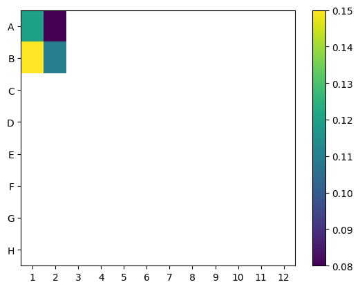
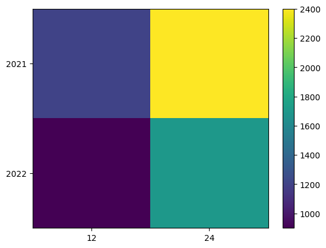

cat > README.md << 'EOF'
# OpsCore Automator (lab + actuarial)

Early-career automation demo: **intake → validation → simple processing → reproducible HTML Run Report** with an audit trail. Two modes share ~90% of the code.

- **Lab:** reads `well,value`, schema-validates, renders a **96-well heatmap**, writes a one-page report.
- **Actuarial:** reads `accident_year,dev,paid`, schema-validates, builds **paid triangles**, computes **LDFs** and simple **CDFs**, writes a one-page report.

> Honesty box: Simulated/sample data; intentionally small and documented. Goal: reliability and clarity, not a production LIMS or reserving system.




- Lab example (open locally): examples/lab_example/report.html
- Actuarial example (open locally): examples/act_example/report.html

## Quickstart
```bash
python3 -m venv .venv
source .venv/bin/activate
pip install -r requirements.txt
python src/ops.py --mode lab --in data_samples/lab/assay_raw.csv
python src/ops.py --mode act --in data_samples/act/claims.csv
